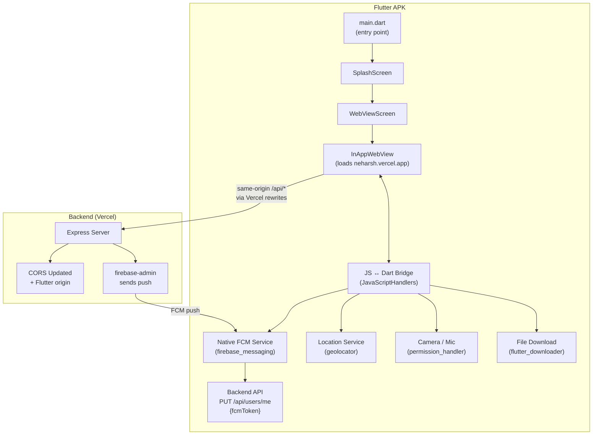
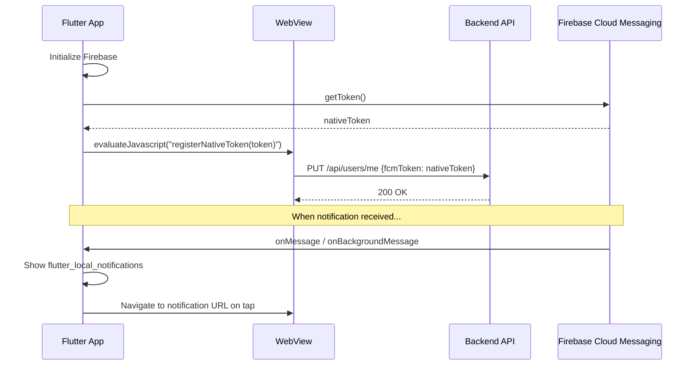

# Flutter InAppWebView APK for Aura — Couple App

## Background & Problem

**Aura** is a MERN-stack couple app deployed at:
- **Frontend (SPA):** `https://neharsh.vercel.app` — Vite + React 19
- **Backend API:** `https://my-app-theta-three-81.vercel.app/api` — Express on Vercel

The web app already supports: real-time chat (Firebase RTDB), push notifications (FCM via service worker), location tracking (Geolocation API), file/image/video/audio uploads (Cloudinary via `/api/upload`), galleries, albums, calendars, timelines, stories, and an admin panel.

**Goal:** Build a native Android APK using **Flutter + flutter_inappwebview** that loads the production URL inside a WebView and grants native-level access to all device features the web app already uses — making the experience seamless and buttery smooth.

---

## Architecture Overview



---

## User Review Required

> [!IMPORTANT]
> **Firebase Project Configuration Required**
> You need to download `google-services.json` from your Firebase Console (`my-app-78849`) and place it in the Flutter project's `android/app/` directory. Without this file, push notifications won't work.

> [!IMPORTANT]
> **App Signing Key**
> For production, you'll need to generate a keystore file for signing the APK. I will create a debug APK first. For Play Store release, you'll need to provide a keystore or use Play App Signing.

> [!WARNING]
> **Backend CORS Update**
> The backend's CORS config currently blocks requests from origins other than the configured `CLIENT_URL`. Since the WebView loads the production URL (`neharsh.vercel.app`), and the frontend uses same-origin `/api` calls (not cross-origin), **no CORS changes are needed for the primary flow**. However, the cookie `SameSite=None; Secure` settings already in place will work correctly in the WebView.

---

## Open Questions

> [!IMPORTANT]
> **1. App Name & Package ID**
> What should the app be called? Currently using `Aura` as per the web title. What package ID do you want? (e.g., `com.neharsh.aura` or `com.harshvardhan.loveapp`)

> [!IMPORTANT]
> **2. App Icon**
> Do you have a specific app icon/logo you want to use, or should I use the existing `favicon.svg` from the web app and generate adaptive icons from it?

> [!IMPORTANT]
> **3. `google-services.json`**
> Do you have the `google-services.json` file downloaded from your Firebase Console? I will need you to place it in the project after creation.

> [!IMPORTANT]
> **4. Flutter SDK**
> Do you have Flutter SDK installed on your machine? If not, I'll include setup instructions. What version do you have?

---

## Proposed Changes

### Project Structure

The Flutter project will be created **alongside** the existing MERN project:

```
d:\MERN\my app\
├── backend/          (existing)
├── frontend/         (existing)
└── flutter_app/      (NEW - Flutter project)
    ├── android/
    │   ├── app/
    │   │   ├── google-services.json    ← You provide this
    │   │   ├── src/main/
    │   │   │   ├── AndroidManifest.xml
    │   │   │   └── kotlin/.../MainActivity.kt
    │   │   └── build.gradle.kts
    │   ├── build.gradle.kts
    │   └── settings.gradle.kts
    ├── lib/
    │   ├── main.dart
    │   ├── screens/
    │   │   ├── splash_screen.dart
    │   │   └── webview_screen.dart
    │   ├── services/
    │   │   ├── fcm_service.dart
    │   │   ├── download_service.dart
    │   │   └── permission_service.dart
    │   └── utils/
    │       └── constants.dart
    ├── pubspec.yaml
    └── assets/
        └── icon/
            └── app_icon.png
```

---

### Core Flutter App

#### [NEW] `flutter_app/pubspec.yaml`

Core dependencies:
| Package | Purpose |
|---------|---------|
| `flutter_inappwebview: ^6.1.5` | WebView with full control (JS bridge, file upload, download interception, cookie management) |
| `firebase_core: ^3.12.1` | Firebase initialization |
| `firebase_messaging: ^15.2.4` | Native FCM push notifications (replaces browser service worker) |
| `flutter_local_notifications: ^18.0.1` | Show notifications when app is in foreground |
| `geolocator: ^13.0.2` | Native GPS location fetching |
| `permission_handler: ^11.3.1` | Runtime permission requests (camera, mic, location, storage) |
| `flutter_downloader: ^1.11.8` | Background file downloads with progress |
| `path_provider: ^2.1.5` | Access to device download directory |
| `url_launcher: ^6.3.1` | Open external links outside WebView |
| `connectivity_plus: ^6.1.3` | Network state monitoring |

---

#### [NEW] `flutter_app/lib/utils/constants.dart`

```dart
class AppConstants {
  static const String appName = 'Aura';
  static const String webUrl = 'https://neharsh.vercel.app';
  static const String apiBaseUrl = 'https://my-app-theta-three-81.vercel.app/api';
}
```

---

#### [NEW] `flutter_app/lib/main.dart`

- Initialize Firebase
- Initialize Flutter Downloader
- Request notification permissions on startup
- Set up FCM background message handler
- Launch splash screen → WebView screen

---

#### [NEW] `flutter_app/lib/screens/splash_screen.dart`

- Animated splash with app logo and loading indicator
- Pre-checks: network connectivity, permissions
- Smooth transition to WebView screen after 2 seconds or when ready

---

#### [NEW] `flutter_app/lib/screens/webview_screen.dart`

This is the **core** of the app. Key behaviors:

| Feature | Implementation |
|---------|---------------|
| **WebView Loading** | `InAppWebView` loads `https://neharsh.vercel.app` with `useShouldOverrideUrlLoading: true` |
| **Cookie Handling** | `CookieManager` configured with `thirdPartyCookiesEnabled: true`. The production frontend uses same-origin `/api` calls, so httpOnly cookies (refresh token) work as first-party cookies. |
| **File Upload** | `onShowFileChooser` callback to open native file picker / camera for `<input type="file">` |
| **Camera Capture** | `onPermissionRequest` grants `CAMERA` and `MICROPHONE` permissions when WebView requests them (for `capture="environment"` inputs) |
| **File Download** | `onDownloadStartRequest` intercepted → handed to `flutter_downloader` for background download with notification |
| **JavaScript Bridge** | `addJavaScriptHandler` named `'flutterBridge'` to exchange data (FCM token, location coordinates) between Dart and the web app |
| **Navigation** | `shouldOverrideUrlLoading` for external links → open in external browser via `url_launcher` |
| **Pull to Refresh** | `PullToRefreshController` for natural mobile UX |
| **Loading Progress** | Linear progress indicator at top during page loads |
| **Back Button** | Android back button navigates WebView history; exits app only when no history left |
| **Keyboard handling** | `adjustResize` mode for proper keyboard behavior with chat input |
| **Error Page** | Custom offline/error page with retry button |

**WebView Settings:**
```dart
InAppWebViewSettings(
  useShouldOverrideUrlLoading: true,
  mediaPlaybackRequiresUserGesture: false,
  allowFileAccessFromFileURLs: true,
  allowUniversalAccessFromFileURLs: true,
  javaScriptEnabled: true,
  domStorageEnabled: true,
  databaseEnabled: true,
  thirdPartyCookiesEnabled: true,
  allowContentAccess: true,
  useWideViewPort: true,
  supportMultipleWindows: false,
  geolocationEnabled: true,
  mixedContentMode: MixedContentMode.MIXED_CONTENT_ALWAYS_ALLOW,
  userAgent: 'AuraApp/1.0 (Android; Flutter)',
)
```

---

#### [NEW] `flutter_app/lib/services/fcm_service.dart`

**Push Notification Strategy:**

The web app uses Firebase Cloud Messaging via browser service worker (`firebase-messaging-sw.js`). In the native app, we **bypass the browser FCM entirely** and use native FCM instead:

1. **On app launch** → Get native FCM token via `firebase_messaging`
2. **Inject token into WebView** → After WebView loads, execute JavaScript to:
   - Store the native FCM token in `localStorage`
   - Call the backend API `PUT /api/users/me { fcmToken: nativeToken }` to register it
3. **Background messages** → Handled by `FirebaseMessaging.onBackgroundMessage` (Dart)
4. **Foreground messages** → Handled by `FirebaseMessaging.onMessage` → Show via `flutter_local_notifications`
5. **Notification tap** → Navigate WebView to the URL from notification data (`payload.data.url`)

This ensures push notifications work reliably even when the app is killed, without depending on the browser service worker.

---

#### [NEW] `flutter_app/lib/services/download_service.dart`

- Intercept downloads from WebView (`onDownloadStartRequest`)
- Request storage permission
- Download to device's Downloads folder using `flutter_downloader`
- Show download progress notification
- Handle Cloudinary media URLs (images, videos, audio, documents)

---

#### [NEW] `flutter_app/lib/services/permission_service.dart`

Centralized permission management:

| Permission | When Requested | Purpose |
|-----------|----------------|---------|
| `camera` | When user taps camera button in chat or uploads a photo | Image/video capture |
| `microphone` | When user taps voice recording or video capture | Audio/video recording |
| `location` | On app launch (if authenticated) | `useLocationTracker` hook sends coordinates to backend |
| `storage` | When downloading files | Save files to Downloads |
| `notification` | On app launch | FCM push notifications |

All permissions are requested **at the moment they're needed**, not all at once on first launch (except notification which is critical).

---

### Android Configuration

#### [NEW] `flutter_app/android/app/src/main/AndroidManifest.xml`

Required permissions:
```xml
<uses-permission android:name="android.permission.INTERNET" />
<uses-permission android:name="android.permission.ACCESS_FINE_LOCATION" />
<uses-permission android:name="android.permission.ACCESS_COARSE_LOCATION" />
<uses-permission android:name="android.permission.CAMERA" />
<uses-permission android:name="android.permission.RECORD_AUDIO" />
<uses-permission android:name="android.permission.WRITE_EXTERNAL_STORAGE" />
<uses-permission android:name="android.permission.READ_EXTERNAL_STORAGE" />
<uses-permission android:name="android.permission.READ_MEDIA_IMAGES" />
<uses-permission android:name="android.permission.READ_MEDIA_VIDEO" />
<uses-permission android:name="android.permission.READ_MEDIA_AUDIO" />
<uses-permission android:name="android.permission.VIBRATE" />
<uses-permission android:name="android.permission.RECEIVE_BOOT_COMPLETED"/>
<uses-permission android:name="android.permission.FOREGROUND_SERVICE"/>
<uses-permission android:name="android.permission.POST_NOTIFICATIONS"/>
```

Additional config:
- `android:usesCleartextTraffic="true"` (for development)
- `android:hardwareAccelerated="true"` (smooth WebView rendering)
- Provider for file downloads (`FileProvider`)
- FCM default notification channel and icon

---

#### [MODIFY] `flutter_app/android/app/build.gradle.kts`

- Apply Google Services plugin
- Set `minSdkVersion` to 21 (Android 5.0+)
- Set `targetSdkVersion` to 34
- Set `compileSdkVersion` to 34
- Enable multidex

---

### Backend Changes (Minimal)

#### [MODIFY] [server.js](file:///d:/MERN/my%20app/backend/server.js)

Add the Flutter WebView user-agent to the CORS allowed origins recognition. Since the WebView loads `neharsh.vercel.app` directly (same origin), and the frontend resolves `/api` as same-origin, **no CORS changes are strictly needed**. The existing cookie settings (`SameSite=None; Secure`) already handle WebView scenarios.

However, we should add the Flutter app's custom user-agent to a whitelist for analytics/logging purposes, and ensure the CORS `origin` check gracefully handles the `null` origin that some Android WebViews send:

```javascript
// In buildAllowedOrigins() — already handles !origin (non-browser tools)
// WebView from neharsh.vercel.app sends origin = 'https://neharsh.vercel.app'
// which is already the CLIENT_URL in production. ✅ No change needed.
```

> [!NOTE]
> The web frontend's `api.js` already resolves to same-origin `/api` in production (line 17), and the Vercel frontend config rewrites `/api/*` to the backend. This means the Flutter WebView **will use first-party cookies automatically** — no cross-origin cookie issues.

---

## Feature Implementation Details

### 1. Firebase Push Notifications



### 2. Location Fetching

The web app's `useLocationTracker` hook uses `navigator.geolocation`. In the WebView:
- The `InAppWebView` has `geolocationEnabled: true`
- Android permissions for `ACCESS_FINE_LOCATION` are declared
- `onGeolocationPermissionsShowPrompt` callback auto-grants location to the trusted origin
- The existing web code works **as-is** — no changes needed

### 3. Camera Image & Video Capture

The web app uses `<input type="file" capture="environment">` in Chat.jsx. In the WebView:
- `onShowFileChooser` is handled to present the native Android file/camera picker
- Camera and microphone permissions are requested at runtime
- The `acceptTypes` from the file input are forwarded to the native picker
- Both gallery selection and camera capture are supported

### 4. Voice Recording

The web app uses file upload for audio. In the WebView:
- Microphone permission is granted via `onPermissionRequest`
- `<input type="file" accept="audio/*">` works natively through `onShowFileChooser`
- If the web app ever uses `MediaRecorder` API, the WebView supports it with `RECORD_AUDIO` permission

### 5. File Uploading

Works through the existing web flow:
- `<input type="file">` triggers `onShowFileChooser` in InAppWebView
- Native file picker opens with all file types
- Selected file is returned to the WebView's JavaScript
- Existing `api.uploadFileWithProgress()` handles the upload to Cloudinary
- Progress bar in chat UI works as-is

### 6. File Downloading

Intercepted natively for a better experience:
- `onDownloadStartRequest` catches download requests
- `flutter_downloader` handles background download
- Files saved to device's Downloads directory
- Notification shows download progress
- Supports all Cloudinary media types (images, videos, audio, documents)

---

## Verification Plan

### Automated Tests

```bash
# Build the APK
cd d:\MERN\my app\flutter_app
flutter pub get
flutter build apk --debug
```

### Manual Verification

| Feature | How to Test |
|---------|-------------|
| **App Launch** | Install APK → Should show splash → Load web app |
| **Login** | Login with credentials → Should persist across app restarts |
| **Push Notifications** | Send notification from admin panel → Should receive native notification even when app is in background |
| **Location** | Check partner profile → Should show location data |
| **Camera** | Open chat → Tap attachment → Camera → Take photo → Should upload |
| **File Upload** | Open chat → Tap attachment → Gallery → Select file → Should upload with progress |
| **File Download** | Tap download icon on a chat attachment → Should download to device |
| **Voice Recording** | Upload audio file through attachment menu |
| **Back Button** | Navigate through app → Back button should navigate history → Exit on last page |
| **Offline** | Turn off internet → Should show offline error page → Turn on → Retry should work |
| **Cookie Persistence** | Login → Kill app → Reopen → Should still be logged in |
| **Pull to Refresh** | Pull down on any page → Should refresh content |

### Build Outputs

- `flutter_app/build/app/outputs/flutter-apk/app-debug.apk` — Debug APK for testing
- `flutter_app/build/app/outputs/flutter-apk/app-release.apk` — Release APK (requires keystore)
